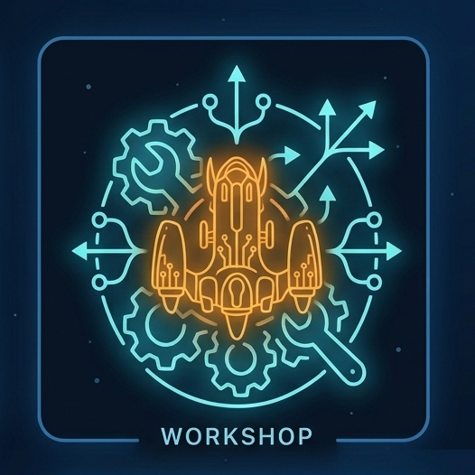

#  space-rangers-mods-workshop

Active development workshop for Space Rangers mods — developed, adapted, and fixed for the current game version.

Original, unmodified mod versions are preserved in the [space-rangers-mods-museum](https://github.com/space-rangers-mods-museum/.github).

## 🚀 Why this workshop exists

- **Develop beyond the archive.** The [museum](https://github.com/space-rangers-mods-museum/.github) preserves mods in their initial state — static snapshots that never change. This workshop is where those mods are actively developed: taken from the museum, unpacked into readable sources, adapted and modernized for the current game version, and released as evolving versions.
- **Give credit and stay open.** Mods forked from museum exhibits credit their original and link back to it; every mod is released under the [CC BY-NC-SA 4.0](https://creativecommons.org/licenses/by-nc-sa/4.0/) license.
- **Separate history from development.** Originals live in the museum; development happens here.

## 📚 Mod catalog

| Mod | Author | Mod | Summary |
|-----|--------|-----|---------|

## ⚖️ License

Every mod in this workshop is released under **Creative Commons Attribution-NonCommercial-ShareAlike 4.0 International (CC BY-NC-SA 4.0)** — whether forked from a museum exhibit or built from scratch. Why this license:

- **Non-Commercial (NC)** — mods cannot be sold or used commercially, keeping the community free and non-commercial on top of a commercial game.
- **Attribution (BY)** — the original author is always credited; a mod's history of authors is never lost or claimed.
- **ShareAlike (SA)** — any further derivative must stay under the same license, giving the community back for every adaptation.
- **Legal status** — mods are unofficial modifications of a commercial game; CC BY-NC-SA 4.0 is an established, clear free license that claims nothing over the original game and keeps the workshop out of commercial use.

For example, **AMod_Spacejunk v2.0.0** bundles only the assets it needs from **LEOGraphicsMod**, dropping its ~500 MB dependency. Its author list therefore carries everyone involved — **Huk** (AMod_Spacejunk), **LEOPARD** (LEOGraphicsMod), and the person who assembled v2.0.0 — so the Attribution clause keeps each of them credited.
